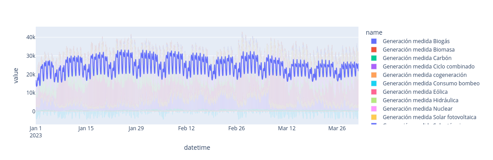
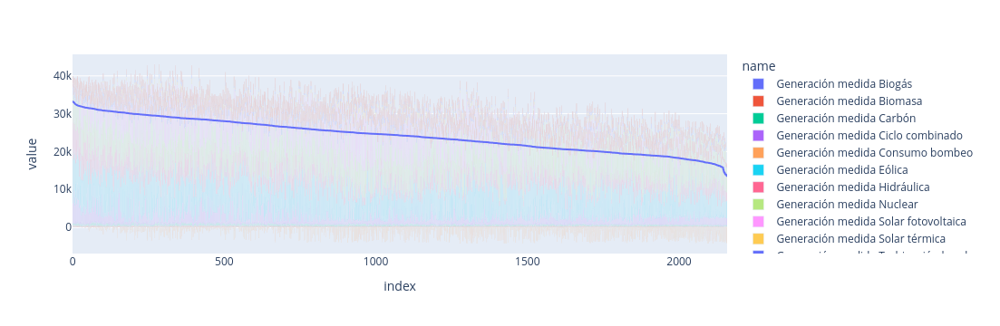

# curva_consumo
Python notebooks to display the consumption graph based on csv file exported from https://www.esios.ree.es/

The main Notebooks are *Demanda por tiempo.ipynb* and *Demanda monotona.ipynb*

They both take as input the consumption data as CSV from [Red Electrica Española](https://www.esios.ree.es/es/analisis/10027?compare_indicators=10141%2C10143%2C10144%2C10145%2C10146%2C10147%2C10148%2C10149%2C10279%2C10142%2C1169%2C1168%2C10036%2C1156%2C10039%2C1172%2C10037%2C1193%2C10035%2C1153%2C1161%2C1162%2C1152&start_date=01-01-2023T00%3A00&geoids=&vis=1&end_date=31-03-2023T23%3A55&compare_start_date=31-12-2022T00%3A00&groupby=hour) saved to the file 'Datos.csv' and produce a plotly graph for the time ordered consumption  and for the demand ordered consumption   
